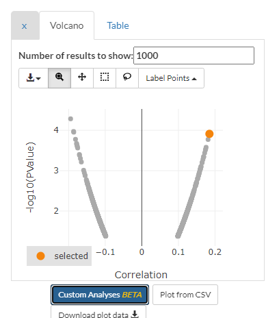
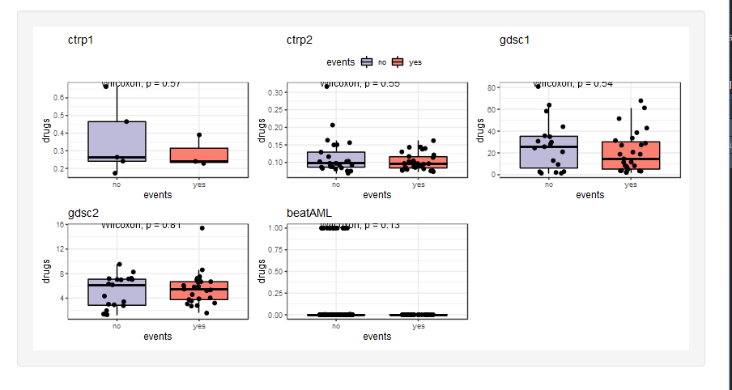
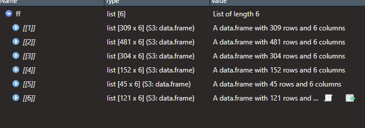
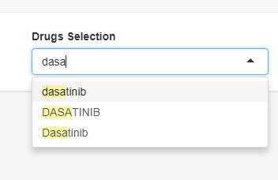
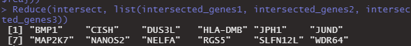
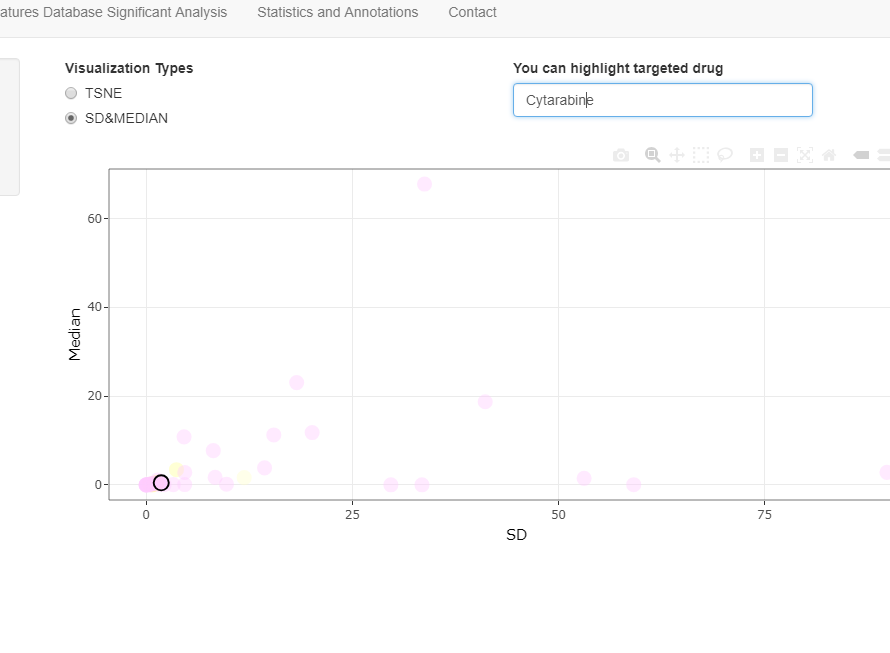
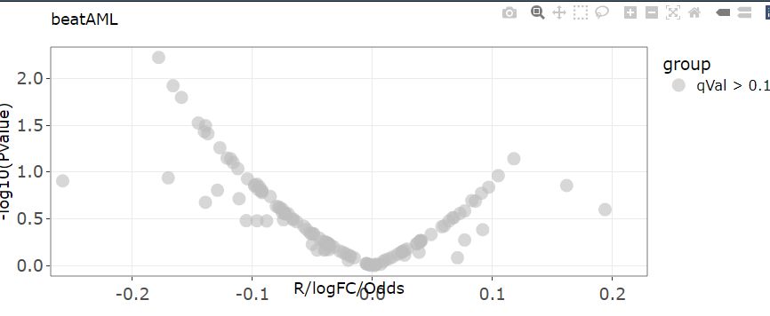
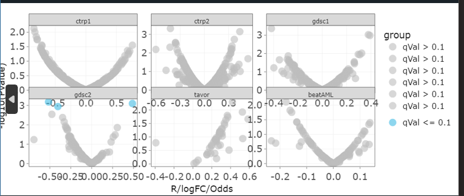
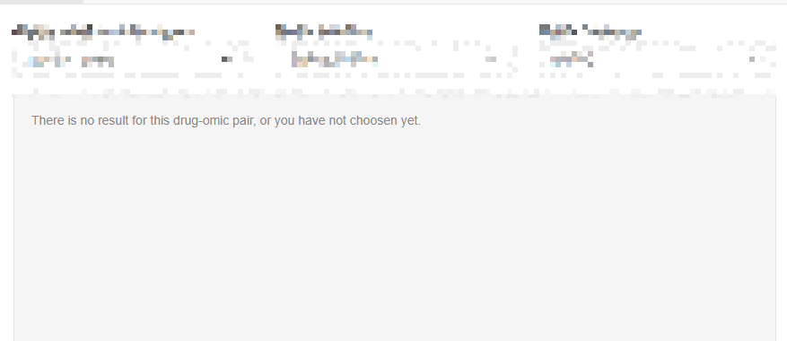

# IDeas

- 看看dss 如何计算
  - [Drug Sensitivity Score (DSS) Analysis (bio-protocol.org)](https://bio-protocol.org/exchange/minidetail?type=30&id=10275394)
  - [Breeze/dss.R at master · potdarswapnil/Breeze (github.com)](https://github.com/potdarswapnil/Breeze/blob/master/dss.R)

- 完成基本分析

- 模仿：

  - 模仿 [PharmacoGx: An R Package for Analysis of Large Pharmacogenomic Datasets (bioconductor.org)](https://www.bioconductor.org/packages/release/bioc/vignettes/PharmacoGx/inst/doc/PharmacoGx.html#sensitivity-modelling)

  - 模仿 iGMDR: Integrated Pharmacogenetic Resource Guide to Cancer Therapy and Research

  - [FORALL](https://proteomics.se/forall/)
  - 模仿gdsc 功能：[Cancer feature: B2M_mut - Cancerrxgene - Genomics of Drug Sensitivity in Cancer](https://www.cancerrxgene.org/feature/B2M_mut/40/volcano?)
  - 模仿ccle 功能：[DepMap Data Explorer](https://depmap.org/portal/interactive/)

整体查看某个药物在各个细胞中的AUC

不同的药物整体比较差别、具体到某个细胞类型比较药物差别

- 如何研究不同之间变量的因果影响呢？
- 未来加入统一的药物分类信息（drugbank），化合物结构信息（pubchem，结构相似度等【RDKit，python】）
- AUC 仅仅是用于相对敏感性的判断。
- 让用户自己选择多变量相关性分析。

  

- each time deploy will rerun all codes including package installation

- omics assosiation or multi-features of a omic assosiation?
  - drug combination [DrugComb update: a more comprehensive drug sensitivity data repository and analysis portal | Nucleic Acids Research | Oxford Academic (oup.com)](https://academic.oup.com/nar/article/49/W1/W174/6290546#267021007)

# todo

- mimics for visualizing all compounds results
  - omics and drugs

- result downloading
- [Vizome](http://www.vizome.org/)

- replace sd with mad

- how to rescue the plot from the retricted square 

# 0913

把图重新画了

zotero 插入

# 0629

设计中的内容贴合到文章中

利用chatgpt 操作

# 0628

functionalities ：

- Drugs sensitivity display
- Features database significant analysis
- Drugs-omics pairs analysis

# 0608

- abstract and introduction
- flowchart

# 0607

- overall writing

# 0606

- result and method

# 0601

- paper writing

# 0531

- download results function
  - 
  - 

# V2

- add promising drugs or drug targets selecion (analysising module)

- drugs with similar but seperate names

# 0526

- function made

- cell line correlation is far from literature result

# 0518

- highlight function
  - 

# 0517

- write paper

# 0516

- module drug sen part
- release v2.0

# 0515

- drug sensitivity analysis UI + code

# 0512

- download FDS analysis results data.frame

# 0511

- drug sensitivity display design

# 0510

- fisher UI

# 0509

- ProgressBar
- fisher fisher situation

# 0508

- finish wilcox and fisher situation
- wilcox plot situ plot server + UI
  - discrete fea + continous db
  - continous db + discrete fea
- suppress warning console

- magic problems??1
  - the return of reactive obj will not be a reactive obj(not function)

- fold change(forall drug has negtive values)
  - replace fold change with median substraction

# 0506

- fix bugs(cor plot situ plot server + UI)
  - `cor_search_list <- cor_search_list[!sapply(cor_search_list, is.null)]`

- wilcox plot situ plot server (two types)
  - intimate code 
  - because if can't reach the same effect like switch inside reactive

# 0505

- cor plot situ plot server + UI

# 0504

- subplot plotly 
  - Ref: https://plotly.com/r/subplots/

- Devide into several situations
  - cor: continuous, continuous
  - wilcox: continuous, discrete
  - fisher: discrete, discrete

- plotly visualization
  - 
    - control the axis 
    - 
  - it's ok, how to deal with legend

# 0429

- if discrete data meet discrete data using fisher Test
  - 

# 0428

- finish Features Database Significant server part1
- 

# 0427

- add addition databases to drug-omic pairs display part

# 0426

- statistics mode

# 0425

- introduce remained datasets part2
- add volcano plot function
- design Features Database Significant UI

# 0424

- drug-omic pairs display
- rescale data into 0-1 (for data expect AAC, score, x/max(x); for AAC, score, 1/(x) then x/max(x))
  - 0 means the highest sensitivity 
- introduce remained datasets part1

# 0423

- modulize code and debug 
- Basic UI redesign

- mubbles

  - tagList 目前来看只能使用html 语法，那就把复杂的server 部分的代码去通过模块化实现吧

  - moduleServer 的id 必须得和其作用域下的ID 一致

  - 报错的根本原因是moduleServer 作用域下获得不了对应的数据框，即drugs_search

  - 为什么切换input 之后，数据不会变呢（跟observeEvent 还是updateSelectizeInput 有关吗）
    - 替换成reactive 对象就可以了，神奇

# 0417

- write part1 analysis part 
- rewrite front end 

# 0414

- add cohort : [Integrative multi-omics and drug response profiling of childhood acute lymphoblastic leukemia cell lines | Nature Communications](https://www.nature.com/articles/s41467-022-29224-5)

# 0413

- add cohort
  - gCSI

# 0412

- add cohort
  - beatAML
  - tavor

find data for [Integrative multi-omics and drug response profiling of childhood acute lymphoblastic leukemia cell lines | Nature Communications](https://www.nature.com/articles/s41467-022-29224-5)

- didn't find protein data

# V1

# 0407

- start writing

# 0331

- analysis module for exp signature 

# 0328

- rownames display on outputdatatable
- use gene signature profile to check the relationship with drug sensitivity 

# 0324

- welcome showmodal

# 0323

- Correctly fix problem of error output replacement

# 0322

- a trick for handling error output

# 0321

- add discrete omics with drugs analysis

- upload to shiny app

- add author info

- translate Chinese front-end into English  

  

# 0317

- fix searching problems
- bugs for mRNA searching(mRNA data is char)
- re value mRNA and meth

# 0316

- merged omics display
- searching main page
- compromise: paste omics and types
- omics with drugs

# 0315

- omics plot and sig output

# 0314

- corplot of selected drugs and omics data

# 0309

- meth, mut, fusion

# 0308

- AUC display and ranking
- plotify tsne 
- circle for searching on tsne 

# 0307

- cell subtype and drug sens
- UI design

# 0306

- raw drug display

# 0303

- each omics:
  - type(wilcox, fisher)
  - drug assosiation(wilcox, cor)

- dont consider big files(more than 50M)

# 0227

- fusion
- CNV

# 0224

- types and mut
- drugs and mut
- shiny

# 0223

- gdsc
  - pharmacoDB obj

- ccle
  - methy PRBS: CCLE_RRBS_TSS_1kb_20180614.txt
  - mut: 22Q2
  - cnv: CCLE_copynumber_byGene_2013-12-03.txt
  - miRNA: CCLE_miRNA_20180525.gct
  - fusion: 22Q2 
  - protein: CCLE_RPPA_20180123

- rearrangement codes

# 230221

- ctrp drug glimpse
- download tavor, gcsi, beataml
- download gdsc molecularProfiles 

- two subtypes
  - cell types
  - leukemia subtypes

# 230203

- Add more datasets, ref: [ORCESTRA](https://orcestra.ca/pset/search), we used phar team processed data
  - [BeatAML_2018](https://orcestra.ca/pset/10.5281/zenodo.6027929)
  - [Tavor_2020](https://orcestra.ca/pset/10.5281/zenodo.5979590)
  - [gCSI_2019](https://orcestra.ca/pset/10.5281/zenodo.4737437)
  - 49 cells 528drugs (sDSS, Selective Drug Sensitivity Score) similar with AUC, but reverse meanings

# 230202

- Glimpse drug response 

- Compare Drugs
  - Similar results but diff targets: THZ-2-102-1(THZ1 ): CDK7; YM-155: BIRC5
    - because THZ1 can also downregulated  BIRC5(survivin) expression [Inhibition of cyclin-dependent kinase 7 suppresses human hepatocellular carcinoma by inducing apoptosis - PubMed](https://pubmed.ncbi.nlm.nih.gov/30145799/)
  - Similar targets but diff results: torin2: MTOR, ATM, ATR, DNAPK; TEMSIROLIMUS: MTOR
    - [The novel mTOR inhibitor Torin-2 induces autophagy and downregulates the expression of UHRF1 to suppress hepatocarcinoma cell growth (spandidos-publications.com)](https://www.spandidos-publications.com/10.3892/or.2015.4146): Until recently, several inhibitors targeting mTOR have been studied for their efficacy in tumor therapy, including rapamycin ([28](https://www.spandidos-publications.com/10.3892/or.2015.4146#b28-or-34-04-1708)) and its derivatives everolimus ([11](https://www.spandidos-publications.com/10.3892/or.2015.4146#b11-or-34-04-1708)), temsirolimus ([29](https://www.spandidos-publications.com/10.3892/or.2015.4146#b29-or-34-04-1708)–[31](https://www.spandidos-publications.com/10.3892/or.2015.4146#b31-or-34-04-1708)) and deforolimus
    - [Dual Targeting of mTOR Activity with Torin2 Potentiates Anticancer Effects of Cisplatin in Epithelial Ovarian Cancer - PMC (nih.gov)](https://www.ncbi.nlm.nih.gov/pmc/articles/PMC4607622/): Even though there has been success in treating advanced stage cancers with mTOR inhibitors, most of the first generation mTOR inhibitors have the propensity to target the mTORC1 complex and it has been shown that by not targeting the mTORC2 complex, resistance against these inhibitors quickly develops via activation of AKT at phosphorylation site Ser473 ([23](https://www.ncbi.nlm.nih.gov/pmc/articles/PMC4607622/#b23-14_238_hussain),[24](https://www.ncbi.nlm.nih.gov/pmc/articles/PMC4607622/#b24-14_238_hussain),[25](https://www.ncbi.nlm.nih.gov/pmc/articles/PMC4607622/#b25-14_238_hussain)). Torin2, a second generation mTOR inhibitor, has the ability to target and inhibit both the mTOR complexes efficiently and therefore has an edge over other first generation inhibitors in effectively inhibiting mTOR activity and inducing apoptosis in cancer cells

# 230201

Only select leukemia:

- gdsc: [Home (cancerrxgene.org)](https://www.cancerrxgene.org/gdsc1000/GDSC1000_WebResources/Home.html )
  - exp: RMA normalised expression data for cell-lines(array)
  - anno: Annotated list of cell-lines
  - drugs: (depmap, [DepMap Data Downloads](https://depmap.org/portal/download/)) AUC, split into gdsc1 and gdsc2
    - anno: [Compounds-annotation](https://cog.sanger.ac.uk/cancerrxgene/GDSC_release8.4/screened_compounds_rel_8.4.csv)
  
- ccle, prism + ctrp1 + ctrp2([DepMap Data Downloads](https://depmap.org/portal/download/all/)): 
  - exp: Affymetrix U133+2 arrays. Raw Affymetrix CEL files were converted to a single value for each probe set using Robust Multi-array Average (RMA) and normalized using quantile normalization. from: DepMap Public 21Q4 Primary Files
  - anno: sample_info From DepMap Public 22Q2
  - drugs:
    - prism1,2: no leukemia
    - ctrp1: only 9 cells
    - ctrp2: 71 cells

